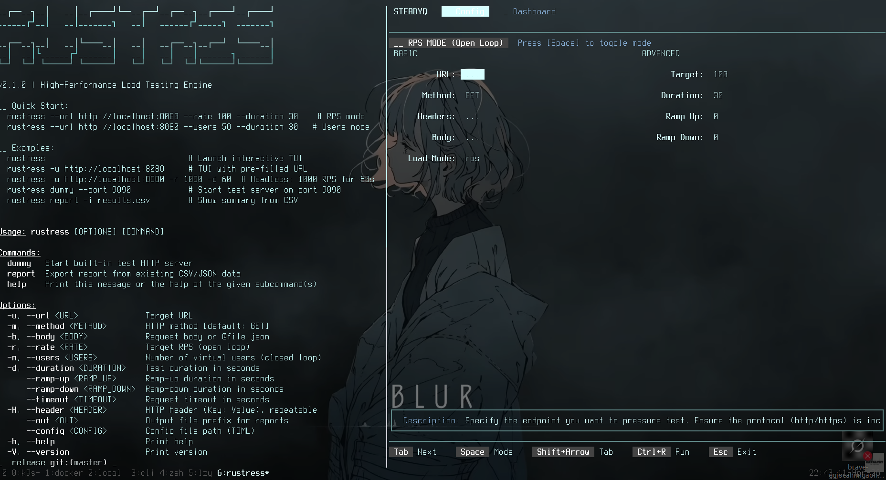

# RuStress: The Ultimate High-Performance Load Testing Engine



<p align="center">
  
  
  
  
</p>

**RuStress** is a professional-grade, terminal-native load testing tool engineered for precision, speed, and real-time observability. Built entirely in Rust using the `tokio` asynchronous runtime and `ratatui` for its interactive dashboard, RuStress empowers engineers to validate system performance without the friction of heavy web-based dashboards or complex DSLs.

---

## 🌟 Introduction

In the world of modern microservices, understanding how your system behaves under pressure is not a luxury—it's a requirement. RuStress was designed to bridge the gap between simple tools like `ab` or `wrk` and complex, enterprise-level solutions. It provides the raw power of a Rust-native execution engine with the intuitive feedback of a real-time dashboard.

Whether you are an SRE tracking down a 99th-percentile latency spike or a Backend Developer validating a new database index, RuStress provides the tools to simulate realistic traffic patterns and visualize the results instantly.

---

## 🧠 Core Philosophy

- **Speed First**: RuStress uses zero-cost abstractions and manual memory management where it counts to ensure the tool itself isn't the bottleneck.
- **Terminal Native**: Everything happens in your shell. No dependencies on browsers, JavaScript runtimes, or external databases.
- **Observability**: Real-time feedback is king. Waiting for a test to finish to see it failed is a waste of time. RuStress shows you every request as it happens.
- **Flexibility**: From simple GET requests to complex POST bodies with dynamic templates, RuStress adapts to your testing needs.

---

## 🚀 Key Features

- **Blazing Fast**: Multi-threaded asynchronous execution capable of saturating even high-bandwidth network interfaces.
- **P50/P90/P95/P99 Metrics**: Detailed latency percentiles updated every second.
- **Status Code Tracking**: Real-time breakdown of 2xx, 3xx, 4xx, and 5xx responses.
- **Ramp-Up/Down Support**: Gradually build load to avoid triggering "cold start" anomalies and observe system recovery during ramp-down.
- **In-Flight visibility**: Monitor exactly how many requests are currently crossing the wire.
- **Dummy Server**: A built-in HTTP server to test your scripts and configurations safely.
- **Templating**: Inject UUIDs, random numbers, or data from external files into your requests dynamically.

---

## 📥 Installation & Setup

### Building from source

1. **Clone the repository**:
   ```bash
   git clone https://github.com/addy-47/rustress.git
   cd rustress
   ```

2. **Build with Cargo**:
   ```bash
   cargo build --release
   ```

3. **Verify the installation**:
   ```bash
   ./target/release/rustress --help
   ```

### Quick Install

If you have the Rust toolchain installed, you can install directly to your path:
```bash
cargo install --path crates/cli
```

---

## 🔄 Operational Modes

RuStress supports two distinct load generation models, each suited for different testing strategies.

### Open Loop (RPS Mode)
In **RPS Mode**, the goal is to hit a target number of requests per second regardless of how long the server takes to respond.
- **Use Case**: Testing system throughput, identifying the "breaking point," and observing queuing behavior.
- **Flag**: `--rate <N>`

### Closed Loop (Users Mode)
In **Users Mode**, RuStress simulates a fixed number of concurrent "Virtual Users" (workers). Each worker sends a request, waits for the response, optionally pauses ("Think Time"), and repeats.
- **Use Case**: Testing concurrent connection limits, session-based state, and real-world user behavior.
- **Flag**: `--users <N>`

---

## 🛠 CLI Deep Dive

RuStress provides a robust CLI interface for headless execution and scripting.

### Global Options

| Flag | Meaning | Detailed Description |
|:---|:---|:---|
| `-u, --url` | Target URL | The full endpoint (e.g., `https://api.v1.com/test`). Supports templates. |
| `-m, --method` | HTTP Method | POST, GET, PUT, PATCH, DELETE, etc. Default: `GET`. |
| `-b, --body` | Payload | The payload string. If it starts with `@` (e.g., `@data.json`), it loads the file content. |
| `-r, --rate` | Requests/Sec | The target throughput for Open Loop mode. |
| `-n, --users` | Virtual Users | The number of parallel workers for Closed Loop mode. |
| `-d, --duration` | Duration | How long the steady-state load should last (in seconds). |
| `--ramp-up` | Build-up | Time in seconds to linearly increase load to the target. |
| `--ramp-down`| Cool-down | Time in seconds to linearly decrease load before stopping. |
| `--timeout` | Timeout | Max time to wait for a single request response (default: 30s). |
| `-H, --header` | Header | Custom header string (`"Key: Value"`). Can be repeated. |
| `--config` | Config File | Path to a TOML file containing all test parameters. |
| `--out` | Report Name | Prefix for the generated `.csv` and `.json` report files. |

### Subcommands

#### `dummy`
The `dummy` command starts a local HTTP server that responds to various endpoints to help you test RuStress itself.
```bash
# Start on port 9090
rustress dummy --port 9090
```
**Available Endpoints:**
- `/fast`: Returns 200 OK instantly.
- `/slow`: Returns 200 OK after 500ms.
- `/error`: Returns 500 Internal Server Error.
- `/random`: Randomly returns success or failure.

#### `report`
Takes an existing RuStress report and displays a consolidated summary.
```bash
rustress report --input results_20231027.csv
```

---

## 🧪 Tactical Scenarios

### Scenario A: Baseline Throughput
Test your API's steady-state performance at 100 RPS for 5 minutes.
```bash
rustress --url http://api.internal/v1/health \
         --rate 100 \
         --duration 300
```

### Scenario B: Spike & Ramp Testing
Test how your auto-scaler reacts by ramping from 0 to 1000 RPS over 2 minutes, staying there for 5 minutes, and then ramping down.
```bash
rustress --url http://api.internal/v1/search \
         --rate 1000 \
         --ramp-up 120 \
         --duration 300 \
         --ramp-down 60 \
         --out search_spike_results
```

### Scenario C: Authenticated User Flow
Simulate 100 concurrent users logging in and fetching their profile.
```bash
rustress --url http://api.internal/v1/profile \
         --header "Authorization: Bearer {{ random_line('tokens.txt') }}" \
         --users 100 \
         --duration 600
```

### Scenario D: Local Network Simulation
Use the `dummy` server to ensure your templating logic is correct before running against production.
```bash
# Terminal 1
rustress dummy --port 8080

# Terminal 2
rustress --url http://localhost:8080/fast \
         --body '{"id": "{{ uuid() }}", "val": {{ random_int(1, 100) }} }' \
         --rate 10 \
         --duration 30
```

---

## 🎮 Interactive TUI Guide

When you run `rustress` without a URL, you enter the **Interactive Configurator**.

### Configuration View
This view allows you to tweak your test parameters using a form-based interface.
- **Navigation**: Use `Tab` or `Arrow Keys` to move between fields.
- **Selection**: Use `Space` to toggle the Load Mode.
- **Execution**: Press `Ctrl+R` to start the test and jump to the Dashboard.

### Dashboard View
The live engine view shows real-time performance telemetry.
- **Top Bar**: Shows current state (RUNNING/DRAINING) and test progress.
- **Left Panel**: Aggregated stats (Total, Success, Error, In-Flight).
- **Latency Graph**: Sparklines showing P50, P90, P95, and P99 over the last 100 seconds.
- **Status Codes**: A bar chart or list of current HTTP responses categorized by class.
- **Real-time Adjust**: Press `+` or `-` to increase or decrease the target load on the fly!

---

## 🧩 Dynamic Templating Engine

RuStress supports a powerful templating syntax using `{{ }}` tags. These are evaluated for **every single request**, allowing for truly dynamic testing sequences.

| Tag | Result | Example |
|:---|:---|:---|
| `{{ userID }}` | Current worker ID | `user-42` |
| `{{ uuid() }}` | A fresh UUID v4 | `f47ac10b-58cc-4372-a567-0e02b2c3d479` |
| `{{ random_int(min, max) }}` | A random integer | `42` |
| `{{ random_choice(["A", "B"]) }}` | Selection from list | `B` |
| `{{ random_line("file.txt") }}` | Random line from file | `alice@example.com` |
| `{{ read_file("body.json") }}` | Inject file content | `{"name": "test"}` |

### Advanced Example: Dynamic Body
```bash
rustress --url http://api.com/v1/update \
         --method POST \
         --body '{"request_id": "{{ uuid() }}", "user_group": {{ random_int(1, 5) }} }' \
         --rate 50 \
         --duration 60
```

---

## 📉 Reporting & Analysis

RuStress saves data with high precision to avoid the "coordinated omission" problem commonly found in older load testing tools.

### `_results.csv`
A high-throughput log format. Perfect for importing into Grafana, Excel, or custom Python scripts.
- **Fields**: `timestamp`, `latency_ms`, `status`, `bytes`, `success`.

### `_results.json`
A deep telemetry format including `service_time` vs `queue_wait_time`. If RuStress is struggling to send requests due to local CPU limits, the `queue_wait` will increase, signaling that the bottleneck is the test runner itself.

---

## ⚙️ Performance Tuning

To get the most out of RuStress on high-end hardware:
1. **Increase File Descriptors**: Run `ulimit -n 65535` to ensure the OS doesn't block outgoing connections.
2. **Thread Management**: RuStress automatically uses all available CPU cores via the Tokio multi-threaded scheduler.
3. **Timeout Selection**: On slow networks, increasing `--timeout` can prevent false-positive failures due to network jitter.

---

## ⚖️ License

RuStress is licensed under the **MIT License**. We believe in open, transparent tools for everyone.

---

<p align="center">
  <b>Built with 🦀 in Rust</b>
</p>
